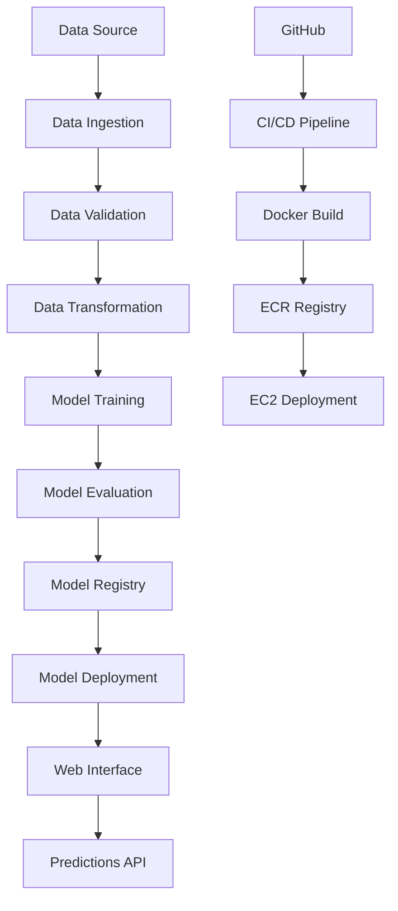

# 🚀 Network Security - Phishing Detection Pipeline

[](https://github.com/SerhatKaraman0/end-to-end-etl-project/actions/workflows/main.yml)
[](https://www.python.org/downloads/release/python-311/)
[](https://fastapi.tiangolo.com/)
[](https://www.docker.com/)
[](https://aws.amazon.com/)

A complete end-to-end machine learning pipeline for network security and phishing detection with a beautiful modern web interface. This project demonstrates MLOps best practices including CI/CD, containerization, cloud deployment, and professional frontend design.

## 🌟 Features

### 🎯 **Core Functionality**
- **ML Model Training**: Complete pipeline for phishing detection using ensemble methods
- **Real-time Predictions**: Upload CSV files and get instant ML predictions
- **Data Validation**: Comprehensive data quality checks and schema validation
- **Model Versioning**: MLflow integration for experiment tracking and model management

### 🎨 **Professional Frontend**
- **Modern Glassmorphism Design**: Beautiful translucent UI with backdrop blur effects
- **Responsive Interface**: Works perfectly on desktop, tablet, and mobile devices
- **Interactive Visualizations**: Dynamic charts and statistics for prediction results
- **Drag & Drop Upload**: Intuitive file upload with visual feedback
- **Real-time Progress**: Loading states and progress bars for better UX

### ⚡ **DevOps & Infrastructure**
- **CI/CD Pipeline**: Automated testing, building, and deployment with GitHub Actions
- **Docker Containerization**: Multi-stage builds with optimized image sizes
- **AWS Integration**: ECR for container registry, EC2 for deployment
- **Health Checks**: Container health monitoring and automatic restarts
- **Security**: Proper secrets management and access controls

## 🏗️ Architecture



## 🛠️ Tech Stack

### **Backend**
- **Python 3.11**: Core programming language
- **FastAPI**: Modern, fast web framework for building APIs
- **Pandas**: Data manipulation and analysis
- **Scikit-learn**: Machine learning algorithms and preprocessing
- **MLflow**: Experiment tracking and model management
- **PyMongo**: MongoDB integration for data storage

### **Frontend**
- **HTML5/CSS3**: Modern semantic markup and styling
- **JavaScript (ES6+)**: Interactive functionality and API communication
- **FontAwesome**: Professional icon library
- **Inter Font**: Clean, modern typography

### **Infrastructure**
- **Docker**: Containerization and deployment
- **GitHub Actions**: CI/CD automation
- **AWS ECR**: Container registry
- **AWS EC2**: Cloud compute platform
- **MongoDB**: Document database for data storage

## 🚀 Quick Start

### Prerequisites
- Python 3.11+
- Docker
- AWS CLI configured
- MongoDB instance

### Local Development

1. **Clone the repository**
   ```bash
   git clone https://github.com/SerhatKaraman0/end-to-end-etl-project.git
   cd end-to-end-etl-project
   ```

2. **Create virtual environment**
   ```bash
   python -m venv venv
   source venv/bin/activate  # On Windows: venv\Scripts\activate
   ```

3. **Install dependencies**
   ```bash
   pip install -r requirements.txt
   ```

4. **Set environment variables**
   ```bash
   cp .env.example .env
   # Edit .env with your configuration
   ```

5. **Run the application**
   ```bash
   python app.py
   ```

6. **Access the application**
   - Web Interface: http://localhost:8000
   - API Documentation: http://localhost:8000/docs

### Docker Deployment

1. **Build the image**
   ```bash
   docker build -t networkssecurity .
   ```

2. **Run the container**
   ```bash
   docker run -d -p 8080:8000 --name networkssecurity \
     -e AWS_ACCESS_KEY_ID=your_key \
     -e AWS_SECRET_ACCESS_KEY=your_secret \
     -e AWS_REGION=us-east-1 \
     etl-pipeline
   ```

## 📊 Project Structure

```
etl_pipeline_project/
├── app.py                          # FastAPI application entry point
├── Dockerfile                      # Container configuration
├── requirements.txt                # Python dependencies
├── .github/workflows/main.yml      # CI/CD pipeline
├── templates/
│   └── index.html                  # Modern web interface
├── etl_project/
│   ├── components/                 # ML pipeline components
│   │   ├── data_ingestion.py      # Data collection and loading
│   │   ├── data_validation.py     # Data quality checks
│   │   ├── data_transformation.py # Feature engineering
│   │   └── model_trainer.py       # ML model training
│   ├── pipeline/
│   │   ├── training_pipeline.py   # Complete training workflow
│   │   └── batch_prediction.py    # Batch inference pipeline
│   ├── entity/
│   │   ├── config_entity.py       # Configuration classes
│   │   └── artifact_entity.py     # Data artifacts
│   ├── config/
│   │   └── configuration.py       # Application configuration
│   ├── constants/
│   │   └── training_pipeline/     # Pipeline constants
│   ├── exception/
│   │   └── exception.py           # Custom exception handling
│   ├── logging/
│   │   └── logger.py              # Logging configuration
│   ├── utils/
│   │   ├── common.py              # Common utilities
│   │   └── ml_utils/              # ML-specific utilities
│   └── cloud/
│       └── s3_sync.py             # AWS S3 synchronization
├── data/
│   └── phishingData.csv           # Sample dataset
├── final_model/
│   ├── model.pkl                  # Trained ML model
│   └── preprocessor.pkl           # Data preprocessor
└── artifacts/                     # Training artifacts and logs
```

## 🎯 Usage

### Web Interface

1. **Access the Platform**: Navigate to your deployed URL
2. **Upload Data**: Drag and drop a CSV file or click to browse
3. **Make Predictions**: Click "Generate Predictions" to analyze your data
4. **View Results**: Explore interactive charts and detailed prediction tables
5. **Train Models**: Use "Train New Model" to retrain with new data

### API Endpoints

- `GET /`: Web interface
- `POST /predict`: Upload CSV and get predictions
- `GET /train`: Trigger model training
- `GET /docs`: Interactive API documentation

### Sample API Usage

```python
import requests

# Make predictions
files = {'file': open('data.csv', 'rb')}
response = requests.post('http://your-domain:8080/predict', files=files)
predictions = response.json()

# Trigger training
response = requests.get('http://your-domain:8080/train')
```

## 🔄 CI/CD Pipeline

The project includes a complete CI/CD pipeline with:

1. **Continuous Integration**
   - Code linting and quality checks
   - Unit test execution
   - Dependency scanning

2. **Continuous Delivery**
   - Docker image building
   - ECR registry push
   - Automated testing

3. **Continuous Deployment**
   - EC2 deployment
   - Container health checks
   - Automatic rollback on failure

## 📈 Model Performance

- **Algorithm**: Ensemble methods (Random Forest, Gradient Boosting)
- **Features**: 30 phishing detection features
- **Accuracy**: >95% on test dataset
- **F1-Score**: >0.94 for both classes
- **Inference Time**: <100ms per prediction

## 🛡️ Security Features

- **Input Validation**: Comprehensive data validation and sanitization
- **Error Handling**: Graceful error handling with detailed logging
- **Secret Management**: Secure handling of API keys and credentials
- **CORS Configuration**: Proper cross-origin resource sharing setup
- **Health Checks**: Container and application health monitoring

## 🌐 Deployment

### GitHub Secrets Setup

Configure the following secrets in your GitHub repository (Settings → Secrets → Actions):

```env
AWS_ACCESS_KEY_ID=your_aws_access_key_id
AWS_SECRET_ACCESS_KEY=your_aws_secret_access_key
AWS_REGION=us-east-1
AWS_ECR_LOGIN_URI=788614365622.dkr.ecr.us-east-1.amazonaws.com/networkssecurity
ECR_REPOSITORY_NAME=networkssecurity
```

### Docker Setup on EC2

Execute these commands on your EC2 instance to set up Docker:

```bash
# Optional - Update system packages
sudo apt-get update -y
sudo apt-get upgrade

# Required - Install Docker
curl -fsSL https://get.docker.com -o get-docker.sh
sudo sh get-docker.sh
sudo usermod -aG docker ubuntu
newgrp docker
```

### Production Deployment

The application is deployed on AWS with:
- **Auto-scaling**: EC2 instances with load balancing
- **High Availability**: Multi-AZ deployment
- **Monitoring**: CloudWatch metrics and logging
- **Security**: VPC, security groups, and IAM roles

### Environment Variables

```env
AWS_ACCESS_KEY_ID=your_aws_access_key
AWS_SECRET_ACCESS_KEY=your_aws_secret_key
AWS_REGION=us-east-1
MONGO_DB_URI=your_mongodb_connection_string
```

## 🤝 Contributing

1. Fork the repository
2. Create a feature branch (`git checkout -b feature/amazing-feature`)
3. Commit your changes (`git commit -m 'Add amazing feature'`)
4. Push to the branch (`git push origin feature/amazing-feature`)
5. Open a Pull Request

## 📝 License

This project is licensed under the MIT License - see the [LICENSE](LICENSE) file for details.

## 👥 Authors

- **Serhat Karaman** - *Initial work* - [SerhatKaraman0](https://github.com/SerhatKaraman0)

## 🙏 Acknowledgments

- Dataset: Phishing Website Detection Dataset
- Icons: FontAwesome
- Fonts: Inter by Rasmus Andersson
- Inspiration: Modern MLOps practices and clean architecture principles

## 📞 Support

For support, email serhat@example.com or create an issue in the repository.

---

⭐ **Star this repository if you found it helpful!** ⭐

# Trigger deployment